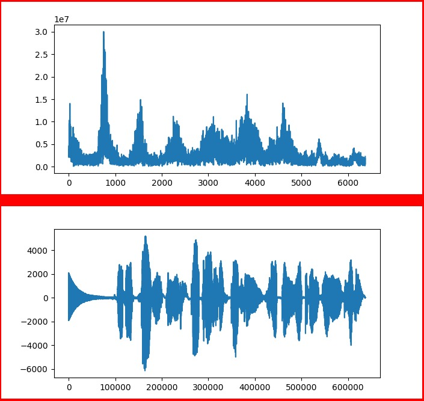
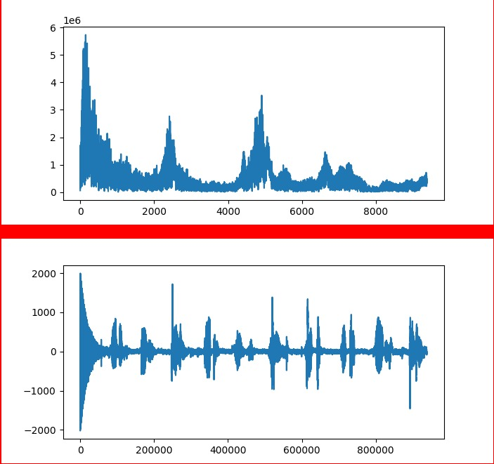

# ¿Porqué las voces del integrante 1, integrante 2 e integrante 3 son diferentes?

## Razón natural:
Los tractos vocales que se restringen justo por encima de las cuerdas vocales tienden a ampificar frecuencias más altas. Las personas con voces estruendosas tienen cuerdas
vocales que producen frecuencias altas y tractos vocales que las amplifican, ahora.. que tiene que ver esto con los armónicos? 
para ello debemos de definir que es un armónico, pues un armónico es una frecuencia que se produce en conjunto a una nota fundamental y que es múltiplo de una nota. Por ejemplo, 
los armónicos del A de 110hz serán 220hz, 330hz, 440hz, 550hz, etc. esta siempre es diferente en cuanto a notas refiere, pero además hay más factores que alteran este tracto
vocal. Por ejemplo la renosancia, esta resonancia consiste en un espacio donde un sonido puede resonar y ser modificado, consiste en un contenedor de aire que tiene que tener una 
entrada para el sonido. Un espacio grande amplifica frecuencias más bajas y un espacio estrecho amplifica frecuencias altas. Compara la diferencia entre el sonido de un 
timbal, un bombo, una conga o un bongó, mientras más grande es la superficie, más grave suena. 

Ahora.. La región subvocal comprende entre los 250hz a 1400hz (dependiendo de cuál sea la nota fundamental), aunque la mayoría de las personas sólo llegarán a 1000hz en esta zona.
 Esta región es amplificada por el primer formante, es el formante más bajo y de los más fuertes. Por esta razón las voces tienen a diferir entre personas en cuanto a Hertz.
 
Existen varios factores físicos que también alteran el sonido de la voz, como por ejemplo factores nasales, espacio de la faringe, entre otras.
 
## Armonicos Fourier:
El francés Jean-Baptiste Fourier probó que cualquier función periódica de comportamiento razonable, se puede construir sumando una cantidad de senos y cosenos donde estas
representan amplitudes de seno y coseno de enésimos armónicos que la componen. Tal descomposición se conoce como serie de Fourier. A partir de ella es posible reconstruir 
la función, es decir si se conoce el periodo de tiempo y se dan las amplitudes, la función original del tiempo puede encontrarse realizando las sumas que se muestran en
la ecuación de Fourier. 
Todos los sonidos están compuestos por una serie de armónicos, que le dan al sonido un timbre particular, Cada armónico de esta serie tiene una amplitud (volumen o fuerza 
del sonido) diferente, lo que lo hace única.
 
## Prueba: 

Audio uno
 
 

Audio dos
 
 
 
 
como se puede apresar son diferentes pese a que en ambos casos se realizó una cuenta del 1 al 10, y esto se debe a factores tanto naturales como a los propios armónicos que cada sonido tiene.

## Referencia:
Tanenbaum, A. Computer Networks. 4ta edición 

