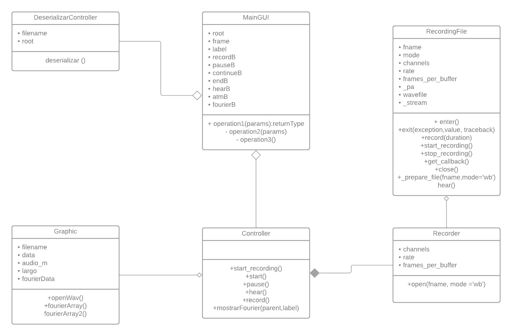

# Redes_IC7602-2022 

## Resumen ejecutivo
En esta tarea implementamos un analizador de espectros simples para archivos de tipo audio, con 2 modos de operación (Analizador y Reproductor).

La parte del Analizador se hace uso del micrófono que toma señales de audio streaming desde donde se puede iniciar, pausar o terminar una grabación,
además de poder escuchar el audio grabado, este audio es inmediatamente guardado como un archivo .wav que sirve como objeto de cálculos.
La implementación de Fourier permite ver la transformada de Fourier en una gráfica donde se detalla los componentes de frecuencia obtenidos, además mediante
estas gráficas se puede visualizar el audio en el tiempo y dominio de frecuencia. Estos datos son guardados en un archivo .atm donde se serializa guardando
el audio, y los datos necesarios para generar las gráficas.

La parte del Reproductor de audio se toma el archivo generado por el Analizador con extensión .atm deserializando el archivo para poder reproducir el audio
al mismo tiempo que genera los gráficos en el dominio del tiempo y dominio de frecuencia.

## Introdución
Un analizador de espectro es una herramienta de medición que permite visualizar en los componentes espectrales en un espectro de frecuencias de las señales presentes
en la entrada, pudiendo ésta cualquier tipo de ondas eléctricas o acústicas. El uso principal es medir la potencia del espectro de señales conocidas y desconocidas. Además
de eso, los analizadores de espectro a menudo tienen herramientas y características para un análisis de señal más profundo adecuado para diferentes dominios de aplicación.
Un espectro es una representación gráfica de la señal en función de una variable dependiente.

Un espectro de sonido, por ejemplo, es una representación de un sonido, generalmente una muestra corta de un sonido, en términos de la cantidad de vibración en cada 
frecuencia individual. Por lo general, se presenta como un gráfico de potencia o presión en función de la frecuencia. La potencia o presión generalmente se mide en
 decibelios y la frecuencia se mide en vibraciones por segundo (o hercios, abreviatura Hz) o miles de vibraciones por segundo (kilohercios, abreviatura kHz).

Normalmente, los analizadores de espectro utilizan FFT (Transformada rápida de Fourier) para obtener la representación de frecuencia a partir de la representación de tiempo.
Una serie de Fourier se puede visualizar como una serie de componentes sinusoidales que juntos forman la forma de los datos de tiempo.

## Descripción de la solución
La solución se realizó en el lenguaje de programación Python bajo el paradigma orientado a objetos, donde se siguió el siguiente diagrama de clases:

El main es el que contiene los distintos componentes de la aplicación, tales como botones, labels, panel, etc. desde este archivo se llama al controlador encargado 
de ejecutar cada acción dependiendo del botón que se clickea.
Se cuenta con 2 controladores, el de Deserializar que es para poder leer y abrir los archivos .atm y el Controller de grabación desde donde se podrá controlar las 
distintas acciones que están relacionados con el audio, tales como Grabar, Escuchar, Pausar, Terminar, etc.
Para generar las gráficas se hace uso de una clase llamada Gráfica donde los atributos del audio son requeridos para generar las gráficas de fourier.

Es indispensable saber como funciona y como se ejecuta este analizador de espectros para lo que tenemos:

### Como Ejecutar
Este trabajo utiliza varias bibliotecas que son necesarias de instalar para hacerlo podemos seguir los siguientes pasos:
- En caso de utilizar VSCode lo optimo es crear un ambiente virtual siguiendo el siguiente video del canal Aditya Thakur
  [Video](https://youtu.be/ThU13tikHQw?t=93)

- Instalar la biblioteca sounddevice 
    > pip install sounddevice
- Instalar la biblioteca scipy
    > pip install scipy
- Istalar la biblioteca numpy
    > pip install numpy
- Instalar la biblioteca matplotlib
    > pip install matplotlib
- Instalar la biblioteca wavio
    > pip install wavio
- Instalar pyaudio
    > pip install PyAudio-0.2.11-cp310-cp310-win_amd64.whl

Los links que estoy usando para guiarme:
https://www.geeksforgeeks.org/how-to-embed-matplotlib-charts-in-tkinter-gui/
https://www.youtube.com/watch?v=AShHJdSIxkY

https://pythonprogramming.altervista.org/recording-your-voice-with-sounddevice/

https://gist.github.com/sloria/5693955

### Consideraciones especiales

- Este proyecto se utilizó python versión 3.10

- Primeramente se debe de intalar las bibliotecas necesarias para ejeutar el proyecto,para esto debe de ejecutar el siguiente comando:
    > pip install -r requirements.txt
- Seguidamente la biblioteca pyaudio por lo general da problemas en windows a la hora de la instalacion, por ende en el proyecto
se encuentran 2 versiones de este mismo tanto para la version 3.10 o la version 3.9 
    > pip install \Pyaudio_Libraries\pyaudio-3.10.whl

- Con todo instalado, nada mas se necesita ejecutar el archivo **mainWindow.py**

## Bibliografia
- Steven Loria, https://gist.github.com/sloria/5693955
